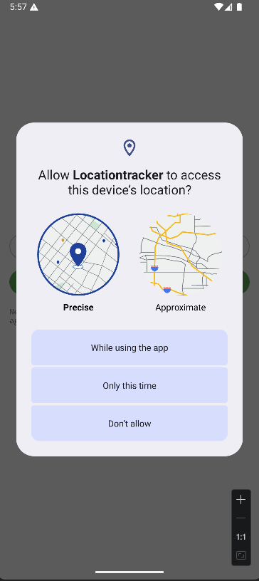
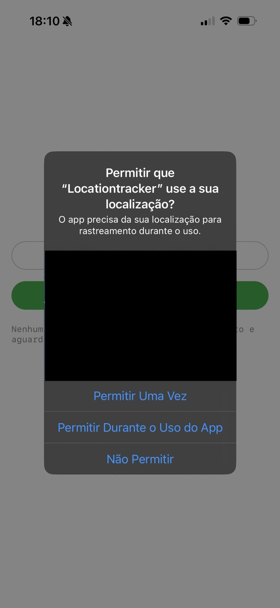
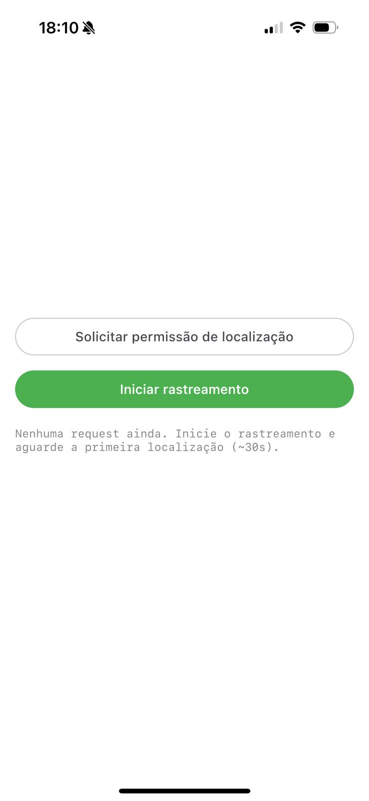
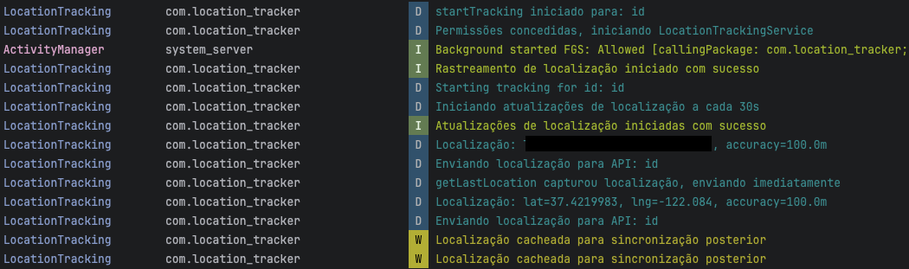

# Location Tracker

App de rastreamento de localização em tempo (quase) real para Android e iOS, feito com **Compose Multiplatform**.

## Screenshots

### Android




## Screen

### Logs



## O que o app faz

- **Captura a localização do dispositivo** em intervalos regulares.
- **Envia as posições para uma API.**
- **Funciona em segundo plano** no Android via serviço em foreground (com notificação).
- **Suporta uso offline**: localizações são guardadas em cache e enviadas quando a rede voltar (WorkManager).
- Na tela, o usuário pode **solicitar permissão de localização**, **iniciar** e **parar** o rastreamento.

## Estrutura do projeto

- **composeApp/** – módulo KMP/Compose principal.
  - **composeApp/src/** – código por target.
    - **commonMain/** – regras e código compartilhado (UI Compose comum, modelos, repositório, API, cache e contratos expect/actual).
    - **androidMain/** – implementações Android (foreground service, WorkManager, permissões, integração com Fused Location Provider e binding Android de rede/cache).
    - **iosMain/** – implementações iOS (integração com Swift host, BG sync entrypoints, cache persistente iOS e disponibilidade de rede).
  - **composeApp/build.gradle.kts** – dependências e configuração do módulo.
- **iosApp/** – projeto Xcode/SwiftUI que embute o framework gerado pelo KMP.
  - **iosApp/iosApp/** – código Swift (entrypoint do app, registro de background tasks, Info.plist, assets).


No Android, a arquitetura inclui:

- **LocationTrackingService** – serviço em foreground que obtém localização (Fused Location Provider) e envia para a API.
- **LocationSyncWorker** – worker que sincroniza localizações pendentes quando há rede.
- **LocationTrackingRepository** – orquestra captura, cache e envio.
- **Api** – contrato e implementação HTTP para enviar os dados de localização.

## Pré-requisitos

- JDK 17+
- Android Studio (para Android) e/ou Xcode (para iOS)
- Android: permissões de localização; iOS: configuração de background e permissões conforme o projeto

## Build e execução

### Android

```bash
./gradlew :composeApp:assembleDebug
```

Ou use a run configuration do Android Studio. O app pede permissão de localização e permite iniciar/parar o rastreamento.

### iOS

Abra a pasta [iosApp](./iosApp) no Xcode e rode o app no simulador ou dispositivo.

## Tecnologias

- Kotlin Multiplatform (KMP)
- Compose Multiplatform (UI)
- Koin (injeção de dependência)
- Android: Fused Location Provider, WorkManager, foreground service
- Envio de localização para API REST

---

## Logs

Exemplo de log do envio para a API (headers + body):

```text
CONTENT HEADERS
Content-Length: 1184
Content-Type: application/json
BODY Content-Type: application/json
BODY START
```

## API

Exemplo de payload enviado:

```json
{
  "id": "eed3d338-f91e-4d1b-a244-d7ef2d64e249",
  "locations": [
    {
      "latitude": 55.5555555,
      "longitude": -55.5555,
      "accuracy": 100.0,
      "altitude": 5.0,
      "trackedAt": "2026-02-16T21:00:41.104866Z"
    },
    {
      "latitude": 55.5555555,
      "longitude": -55.5555,
      "accuracy": 100.0,
      "altitude": 5.0,
      "trackedAt": "2026-02-16T21:00:41.093872Z"
    },
    {
      "latitude": 55.5555555,
      "longitude": -55.5555,
      "accuracy": 5.0,
      "speed": 0.0,
      "altitude": 5.0,
      "trackedAt": "2026-02-16T21:02:20.230281Z"
    }
  ]
}
```

Para mais sobre KMP: [Kotlin Multiplatform](https://www.jetbrains.com/help/kotlin-multiplatform-dev/get-started.html).
